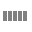
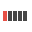
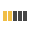
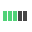
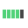
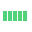
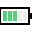
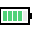
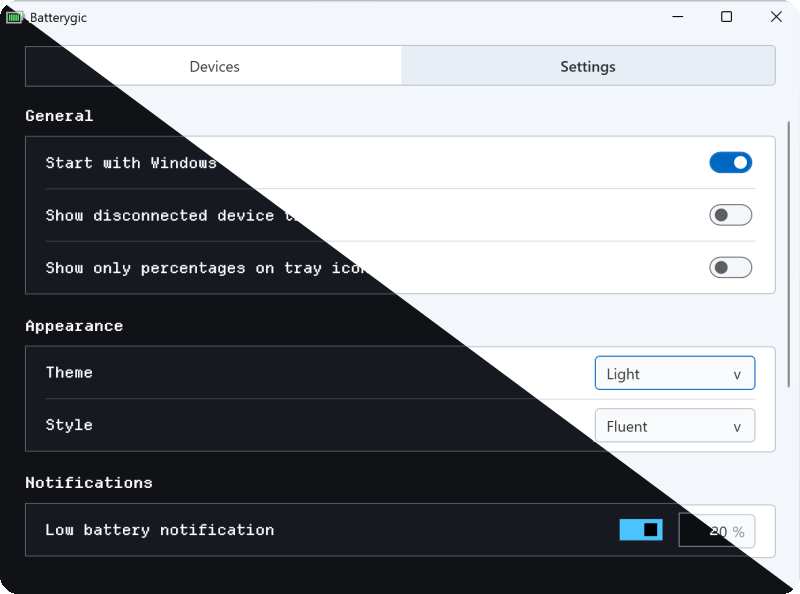

# Batterygic support

This is a support repo for Batterygic app. If you have a problem, [create an issue](https://github.com/Super-Slug-Studios/batterygic-support/issues) in this repo or join our [discord group](https://discord.gg/DqaXVPkQRR) and ask there.

## Tray Icons

<table>
  <tr>
    <td><strong>Fluent White</strong></td>
    <td bgcolor="#111111">
      
      
      
      
      
      
      
    </td>
  </tr>
  <tr>
    <td><strong>Fluent Dark</strong></td>
    <td bgcolor="#cccccc">
      
      
      
      
      
      
      
    </td>
  </tr>
  <tr>
    <td><strong>Pixel White</strong></td>
    <td bgcolor="#111111">
      
      
      
      
      
      
      
    </td>
  </tr>
  <tr>
    <td><strong>Pixel Dark</strong></td>
    <td bgcolor="#cccccc">
      
      
      
      
      
      
      
    </td>
  </tr>
</table>

## Settings

## FAQ

**Q: I cannot see Batterygic icon in my tray icons. What do to?**

A: Go to Taskbar settings -> Other system tray icons -> turn on Batterygic.

## Copyright

Copyright (c) 2026 Super Slug Studios. All rights reserved..
